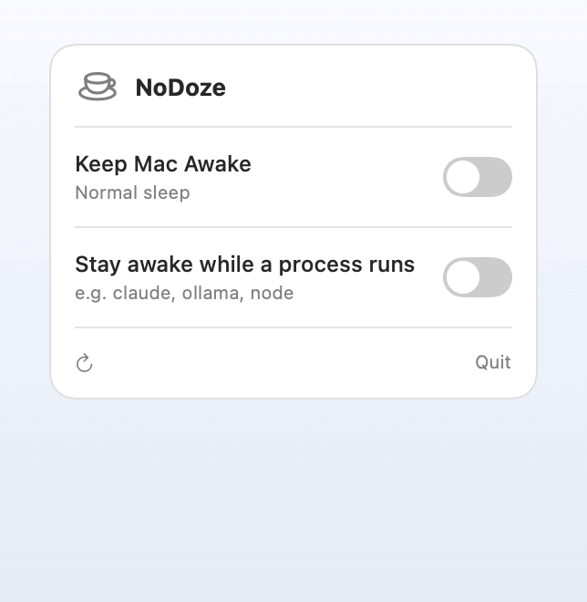

# NoDoze ☕


A dead-simple macOS menu bar app: one toggle to keep your Mac awake — built for
running agents on a laptop that must never sleep, even with the lid shut.

<p align="center">
  
</p>

The toggle runs exactly the `pmset` commands behind the `turnoffsleep` /
`turnonsleep` shell aliases:

| Toggle | Commands |
|--------|----------|
| **On**  | `pmset -a sleep 0` · `pmset -a hibernatemode 0` · `pmset -a disablesleep 1` |
| **Off** | `pmset -a sleep 1` · `pmset -a hibernatemode 3` · `pmset -a disablesleep 0` |

`disablesleep 1` is the key bit — unlike `caffeinate` or Amphetamine, it
disables **lid-close (clamshell) sleep** too, so agents keep running with the
lid down.

## Stay awake only while a process runs

Flip on **"Stay awake while a process runs"** and type a process name
(`claude`, `ollama`, `node`, …). NoDoze polls every 8s via `pgrep -f -i` and:

- keeps the Mac awake while a match is alive, then
- restores normal sleep once it exits — but only the awake state it set itself,
  so a manual "Keep Mac Awake" is never undone behind your back.

Turning **"Keep Mac Awake" off** acts as a kill switch: it also switches watch
mode off, so the watcher can't re-grab keep-awake while the process is still
running. Re-enable watch mode when you want it back.

The watched name and on/off state persist across launches.

## Why pmset, not caffeinate?

`caffeinate` / Amphetamine create a temporary *power assertion* — gone on reboot,
and they don't override lid-close sleep. NoDoze changes the persistent system
setting via `pmset`, including `disablesleep`, so it survives reboot and covers
clamshell. The trade-off: it applies to battery too, so toggle it **off** before
tossing the laptop in a bag.

## Install

```bash
brew install --cask davidcjw/tap/nodoze
```

NoDoze is open source but not notarized (no Apple Developer account), so it's
ad-hoc signed. The cask strips the Gatekeeper quarantine flag on install, so it
just opens — no extra flags. If macOS ever still blocks it:

```bash
xattr -dr com.apple.quarantine /Applications/NoDoze.app
```

## Build

```bash
./build.sh          # produces NoDoze.app (ad-hoc signed)
open NoDoze.app     # runs as a menu bar app (no dock icon)
```

Requires the Swift toolchain (`swiftc`) — already present with Xcode or the
Command Line Tools. macOS 13+.

## Permissions (no setup needed)

`pmset` needs root, and NoDoze handles that for you:

- **Manual toggle** — the first time you flip it, macOS shows the standard admin
  password prompt. Approve it and you're done.
- **Watch mode** — a background poll can't keep prompting, so the first time you
  enable it, NoDoze installs a passwordless-sudo rule for `pmset` via **one**
  native admin prompt (validated with `visudo`). After that it runs silently.

That rule lives at `/etc/sudoers.d/nodoze` and is **scoped to exactly the
commands NoDoze runs** — not a blanket `pmset` grant. sudoers matches the full
argument vector, so it permits only the read-only probe and the six on/off steps:

```
<you> ALL=(root) NOPASSWD: /usr/bin/pmset -g, /usr/bin/pmset -a sleep 0, \
  /usr/bin/pmset -a hibernatemode 0, /usr/bin/pmset -a disablesleep 1, \
  /usr/bin/pmset -a sleep 1, /usr/bin/pmset -a hibernatemode 3, \
  /usr/bin/pmset -a disablesleep 0
```

There's nothing to run by hand. The bundled `scripts/install-sudoers.sh` /
`uninstall-sudoers.sh` are just manual equivalents if you'd rather set it up (or
tear it down) yourself.

## Run at login (optional)

System Settings → General → Login Items → **+** → pick `NoDoze.app`.

## Distributing to others (Homebrew)

GUI apps ship as a **Homebrew Cask**, not a formula. Two routes:

1. **Your own tap (easiest, no review):** push the app as a GitHub Release,
   then a cask in a `homebrew-tap` repo lets anyone run
   `brew install --cask davidcjw/tap/nodoze`.
2. **Official `homebrew/cask`:** stricter — needs a stable versioned download
   URL and a reasonably notable/maintained app.

Two things to know about distributing an unsigned app:

- **No notarization (no Apple Developer account).** The build is *ad-hoc* signed
  (`codesign --sign -`). macOS quarantines downloaded unsigned apps and blocks
  them ("Apple cannot verify…"). Current Homebrew dropped the `--no-quarantine`
  flag, so the cask strips the quarantine flag itself in a `postflight`. (The
  fully clean path is the $99/yr Developer Program → sign with a *Developer ID
  Application* cert → `notarytool submit` → `stapler staple`.)
- **The `pmset` privilege.** Handled in-app, no setup step. A **manual** toggle
  falls back to a native admin prompt; enabling **watch mode** installs a
  passwordless-sudo rule for `pmset` via one admin prompt so the 8s poll runs
  silently. See "Permissions" above.

The live cask lives at
[davidcjw/homebrew-tap](https://github.com/davidcjw/homebrew-tap/blob/main/Casks/nodoze.rb).
For the full step-by-step (bump version, build, tag, release, update cask,
upgrade your own machine), see [RELEASING.md](RELEASING.md).

## Tests

```bash
./tests/run_tests.sh
```

Unit-tests the `SleepDisabled` state parsing against real `pmset -g` formats.

## Project layout

```
Sources/SleepState.swift   pure parsers + watcher decision (all under test)
Sources/PopoverContent.swift  value-driven popover UI (no model/side effects)
Sources/main.swift         SwiftUI MenuBarExtra app + model + shell runner
scripts/make_demo_gif.swift   renders docs/demo.gif from the popover UI
docs/demo.gif              the README demo (regenerate: scripts/build_demo_gif.sh)
Info.plist                 LSUIElement (menu-bar-only, no dock icon)
build.sh                   compile + bundle + ad-hoc sign (builds icon if missing)
AppIcon.icns               app icon (coffee cup on #FF5700 squircle)
scripts/make_icon.swift    renders the 1024px master icon via AppKit
scripts/build_icns.sh      master PNG -> .iconset -> AppIcon.icns
scripts/                   install / uninstall passwordless sudo for pmset
tests/                     SleepState unit tests
```

## App icon

`AppIcon.icns` is generated from code — no design tool needed:

```bash
./scripts/build_icns.sh     # re-render the icon
```

`build.sh` rebuilds it automatically if `AppIcon.icns` is missing.

## Contributing

Contributions are welcome! Please open an issue first to discuss what you'd like to change.

1. Fork the repo
2. Create a feature branch (`git checkout -b feature/your-feature`)
3. Commit your changes (`git commit -m 'feat: describe change'`)
4. Push and open a pull request

Please run `./tests/run_tests.sh` and confirm `./build.sh` succeeds before submitting a PR.

## Code of Conduct

This project follows the [Contributor Covenant v2.1](https://www.contributor-covenant.org/version/2/1/code_of_conduct/).
By participating you agree to uphold a welcoming, harassment-free environment.

## License

Distributed under the MIT License. See [LICENSE](LICENSE) for details.
